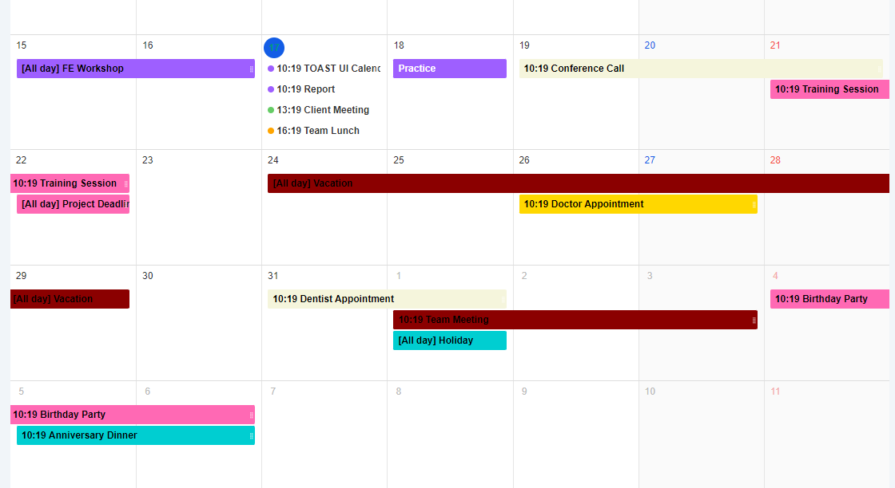

<p align="center">
  <a href="https://github.com/Blue-Pheasant/Odoo-connector">
    
    <h2 align="center">Appointment scheduler</h2>
  </a>
</p> 
<p align="center">The Appointment Scheduler is a web application that provides a platform for users to easily manage their meeting appointments. With features like scheduling, cancelling, and sending invitations, users can efficiently organize their appointments and stay on top of their schedule.</p>


## Technology
ASP.NET and ReactJS are two powerful technologies that can be used together to build modern, scalable web applications.


<p align="center">
  
</p>

### ASP.NET
ASP.NET is a web application framework developed by Microsoft that allows developers to build dynamic, data-driven web applications. It provides a variety of features and tools for building web applications, including support for multiple programming languages, built-in security features, and a robust set of libraries and frameworks.

### ReactJS
ReactJS is a JavaScript library for building user interfaces. It provides a simple and efficient way to create reusable UI components that can be used to build complex, interactive web applications.

ReactJS is widely used in modern web development, and is a popular choice for building dynamic, data-driven web applications.

# Using ASP.NET and ReactJS Together
By combining ASP.NET and ReactJS, developers can build powerful, scalable web applications that leverage the strengths of both technologies. ASP.NET provides a robust back-end framework for managing application logic and data, while ReactJS provides a flexible and efficient way to build user interfaces and manage application state.


## React UI Component
The Appointment Scheduler utilizes the Tui Calendar UI component, which provides an intuitive and user-friendly interface for managing appointments. With Tui Calendar, users can easily view their appointments in a calendar format, drag and drop appointments to different time slots, and interact with appointments to view details or make changes.

## Getting Started
To get started with the Appointment Scheduler, simply clone the repository and follow the installation instructions in the README file. Once installed, you can run the application and start managing your appointments right away.

### Step 1: Clone The Repo

```bash
git clone https://github.com/Blue-Pheasant/scheduler
```

### Step 2: Install Dependencies
1. Install packages for .NET

```bash
dotnet restore
```

2. Install packages for Client app

Access into the project directory

```bash
cd ClientApp
```

Install all the dependencies in `package.json`

```bash
npm install
```

### Step 3: Setup enviroment variables
There is an example of enviroment variables

```json
{
  "Logging": {
    "LogLevel": {
    "Default": "Information",
    "Microsoft": "Warning",
    "Microsoft.Hosting.Lifetime": "Information"
    }
  },
  "AllowedHosts": "*",
  "ConnectionStrings": {
    "DefaultConnection": "Server=DESKTOP-DQ5FOMQ;Database=scheduler;Trusted_Connection=True;"
  },
  "Jwt": {
    "SecretKey": "thisismyfuckingsecretkey"
  }
}
```

1. `DefaultConnection:` SQL server string conenction
2. `SecretKey:` SecretKey for JWT decrypt and encrypt

### Step 4: Run project

In the root folder of project (Include `Program.cs` and `Startup.cs`)

1. Build project

```bash
dotnet build
```

2. Run project

```bash
dotnet run
```

## :open_file_folder: Project structure

A quick look at the folder structure of this project.

    │   README.md
    │
    ├─── ClientApp
    │       Public      
    │       Src
    |        └─── components
    │        └─── layouts  
    |        └─── pages
    |        └─── services
    │       package.json  
    │
    ├─── Controllers
    │   │   UserController.cs       
    │   │   AuthController
    │
    ├─── Data
    │   │   Configurations       
    │   │   Entities
    │   │   Migrations       
    │   │   DBContext.cs
    |
    ├─── Docs
    │
    ├─── Middlewares
    │   │   JwtMiddleware.cs
    │   │   LoggingMiddleware.cs
    │
    ├─── Model
    │   └─── Request
    │   └─── Response
    |
    └─── Services
        ├─── Interfaces
        └─── AuthService.cs
        └─── HashService.cs
        └─── UserService.cs
        └─── TokenService.cs


## Contributing
If you would like to contribute to the development of the Appointment Scheduler, please follow the guidelines in the CONTRIBUTING file. We welcome all contributions and appreciate your support in making the application even better.

## License
The Appointment Scheduler is licensed under the MIT License. See the LICENSE file for more details.
